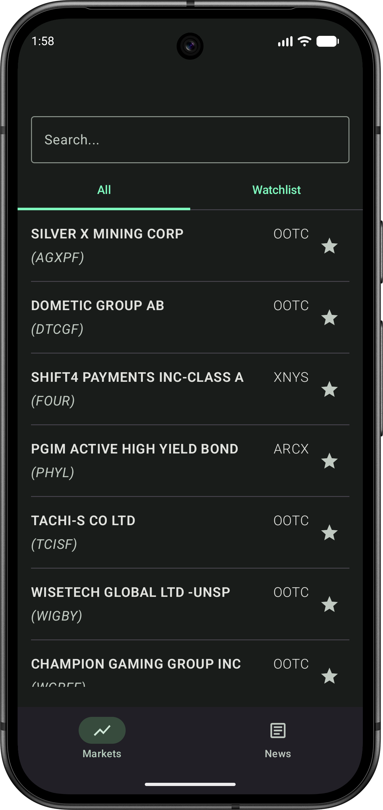
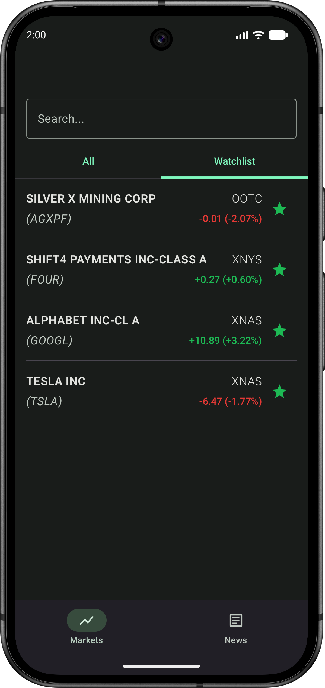
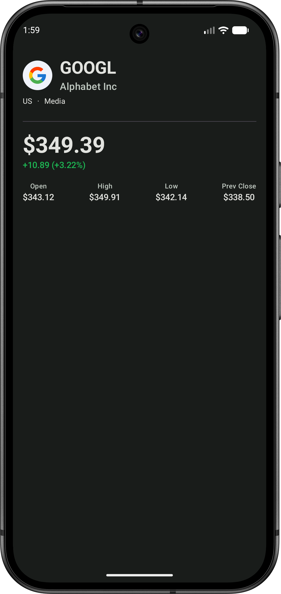
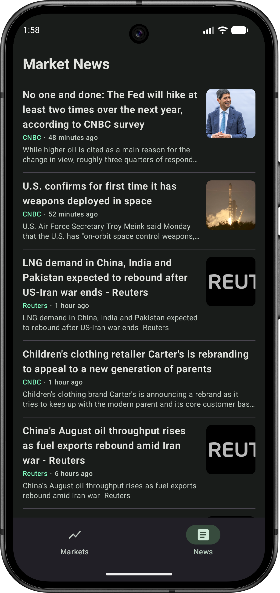

# Stonks

A clean, modern Android stock market app built with Jetpack Compose. Browse thousands of US-listed companies, track a personal watchlist, view real-time quotes and price movement, and follow the latest market news — all from a single app.

---

## Screenshots

| Markets | Watchlist | Detail | News |
|---|---|---|---|
|  |  |  |  |

## Features

- Browse all US-listed stocks with instant search (debounced, cache-first)
- Watchlist / Favorites — star any stock to pin it to the Watchlist tab
- Real-time price change badge — colored `+2.34 (+1.20%)` / `-0.85 (-0.42%)` on the detail screen and on watchlist rows
- Company detail — logo, name, country, industry, current price, open / high / low / previous close
- Two-phase detail loading — company profile appears immediately while the quote shimmer-loads in the background
- Shimmer skeleton screens for initial loads and the quote section
- Market news feed — headlines, source, relative timestamp, thumbnail, tap to open in browser
- Pull-to-refresh on all screens
- Tab navigation (Markets / News) with bottom bar; bar hides on the detail screen
- Snackbar error surfacing with retry on the detail screen
- Custom financial green color theme (light + dark, no dynamic color override)
- Edge-to-edge UI

## Stack

| Layer        | Technology                          |
|--------------|-------------------------------------|
| UI           | Jetpack Compose + Material 3        |
| DI           | Hilt                                |
| Networking   | Retrofit + OkHttp + Moshi           |
| Local cache  | Room                                |
| Image loading| Coil                                |
| Navigation   | Jetpack Navigation Compose (type-safe routes) |
| Architecture | Clean Architecture + MVVM           |

## Architecture

The project follows Clean Architecture with three layers:

```
data  →  domain  ←  presentation
```

- `domain` is pure Kotlin — no Android dependencies
- `data` implements the domain repository interface, handles remote fetches (Finnhub API) and local caching (Room)
- `presentation` reads `StateFlow<ScreenState>` from ViewModels and renders it; no business logic lives here

See [ARCHITECTURE.md](ARCHITECTURE.md) for a full breakdown of every file and package, and [CODEBASE_TOUR.md](CODEBASE_TOUR.md) for a guided reading order that follows the data flow end-to-end.

## Setup

1. Clone the repo
2. Open in Android Studio
3. Obtain a free API key from [Finnhub](https://finnhub.io) (free tier covers all endpoints used)
4. Add your key to `local.properties` at the project root:
   ```
   FINNHUB_API_KEY=your_key_here
   ```
5. Run on a device or emulator

## Data Source

Powered by the [Finnhub API](https://finnhub.io).

| Endpoint              | Used for                                    |
|-----------------------|---------------------------------------------|
| `GET stock/symbol`    | Full US exchange listing (cached in Room)   |
| `GET stock/profile2`  | Company name, country, industry, logo URL   |
| `GET quote`           | Current price, open, high, low, prev. close |
| `GET news`            | General market news feed                    |

The free tier applies a rate limit between successive calls; `GetCompanyDetailUseCase` enforces a 1100 ms delay between the profile and quote fetches to stay within it.
